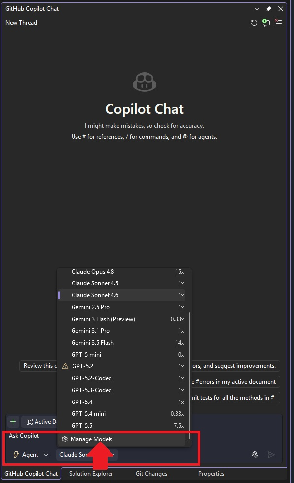
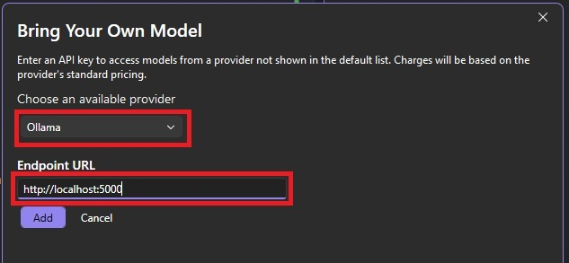
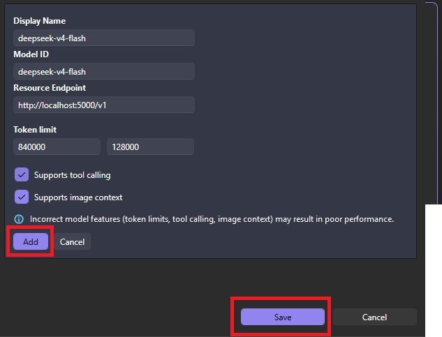

# CopilotDeepSeek — Use DeepSeek Models with GitHub Copilot in Visual Studio

Want to use DeepSeek instead of the default models in GitHub Copilot? That's exactly what this project does. **CopilotDeepSeek** acts as a local proxy that lets you plug DeepSeek into Visual Studio Copilot as a custom model — no hacks, just the official custom model endpoint support built into GitHub Copilot.

Inspired by the great work of [iqmeta](https://github.com/iqmeta/vs2026-copilot-deepseek-v4). I've also kept [my own fork](https://github.com/AlexRasch/vs2026-copilot-deepseek/tree/master) around in case the original disappears.

## Why Use DeepSeek with GitHub Copilot?

GitHub Copilot is a fantastic tool, but the model selection is limited. DeepSeek is one of the most capable open-weight models out there and it doesn't cost a fortune to run — so why not use it?

Here's what makes DeepSeek stand out as a GitHub Copilot alternative:

- **It's cheap** — DeepSeek's API pricing is a fraction of comparable models like GPT-4o or Claude. Great if you're coding heavily or running a team.
- **Tool calling support** — Just like Claude, DeepSeek supports tool calling out of the box. This means agentic features in Copilot Chat — like running commands, searching files, or chaining actions — work as expected.
- **Not natively supported in Copilot** — Despite being this capable, DeepSeek isn't available by default in GitHub Copilot. This project bridges that gap by running a small local server that GitHub Copilot in Visual Studio talks to.

## Features

- Use DeepSeek models directly in Visual Studio Copilot Chat
- Full tool calling support (agentic workflows)
- Securely stores your DeepSeek API key locally using AES encryption\*
- Basic web interface included

\*The API key is stored in `settings.json` using AES encryption.

## Prerequisites

- Windows (Mac and Linux support is planned)
- [.NET 10 Runtime](https://dotnet.microsoft.com/en-us/download/dotnet/10.0)
- Visual Studio with the GitHub Copilot extension installed
- A [DeepSeek API key](https://platform.deepseek.com/)

## Setup

### Download & Run

1. Download the latest release from the [releases page](https://github.com/AlexRasch/CopilotDeepSeek/releases)
2. Extract the zip file to a location of your choice
3. Run `CopilotDeepSeek.exe` — on first launch you'll be prompted to enter your DeepSeek API key
4. Leave it running in the background while you use Visual Studio Copilot

### Build from Source

1. Clone the repository: `git clone https://github.com/AlexRasch/CopilotDeepSeek.git`
2. Open the solution in Visual Studio and build the project
3. Run `CopilotDeepSeek.exe` from the output directory

## Configuring GitHub Copilot in Visual Studio

Once the local server is running, you need to point GitHub Copilot at it:

1. Open Visual Studio and go to **Copilot Chat**
2. Click the model dropdown and select **Manage Models**
   
3. Click **Add new model** → **Custom model**, and enter:
   ```
   http://localhost:5000
   ```
   
4. Fill in the model details:
   ```
   Display name:      deepseek-v4-flash
   Model ID:          deepseek-v4-flash
   Resource Endpoint: http://localhost:5000/v1
   Token limit:       840000 / 128000
   ```
   Enable **Support tool calling** and **Supports image context** if you want those features.
   

> **Note:** The default port is `5000`. If you change it in `appsettings.json`, update the endpoint URL here to match.

## Known Issues

- Limited error handling
- Windows only for now

## Roadmap

- Multiplatform support (Mac, Linux)
- Improved encryption for stored API key
- Better error handling and logging
- More unit tests
- Improved web interface